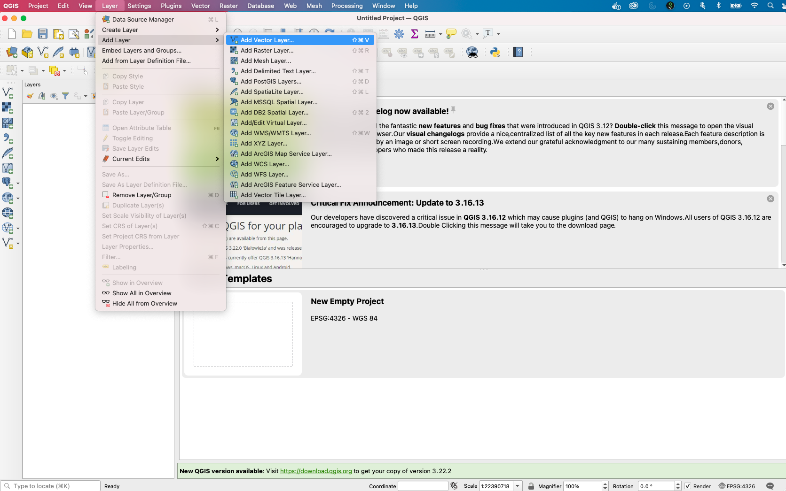
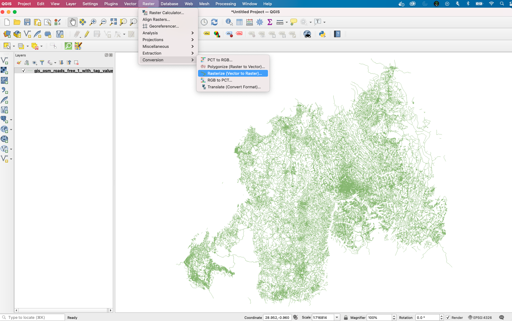
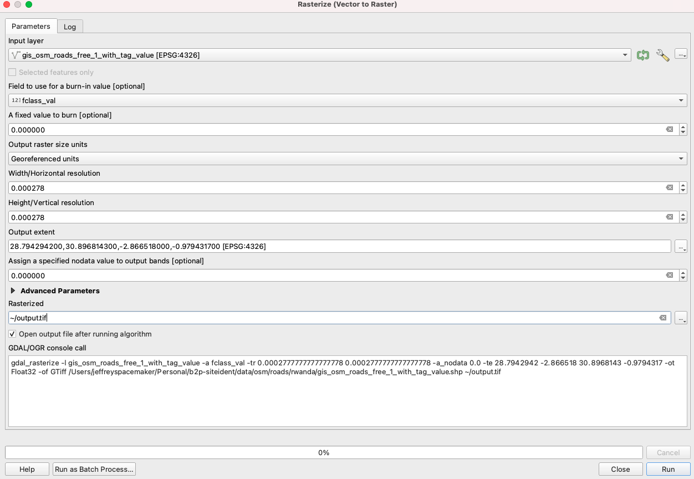

# B2P Remote Trailbridge Needs Assessment

## Install GDAL (MacOS, Ubuntu)

### Install Anaconda environment

```
conda create --name=b2p python=3.7
conda activate b2p
```

### OS X

[Gdal](https://gdal.org/) is a great tool for fast manipulation of rasters. However, it can be tricky to install. The best option it to install with Homebrew (in the current conda environment):

```
brew install gdal
```

Homebrew can be easily installed by following the instructions on [Homebrew's official page](https://brew.sh/).

Currently gdal is being used to rasterize vector data, using `gdal_rasterize` from the command line. Example:
```
gdal_rasterize data/osm/rwanda/roads/gis_osm_roads_free_1_with_tag_value.shp data/osm/rwanda/roads/gis_osm_roads_free_1_with_tag_value.tif -tr 0.0005 0.0005 -a fclass_val
```
The documentation on this service is found [here](https://gdal.org/programs/gdal_rasterize.html).

### Ubuntu

[Gdal](https://gdal.org/) can be also installed with Anaconda:

```
conda activate b2p
conda config --add channels conda-forge
conda config --set channel_priority strict
conda install gdal
```

## Install a anaconda environment and required packages
For reproducibility of all scripts, we can list all required packages in `requirements.txt`.
Please feel free to update the requirements.txt if you are using additional packages.

```
conda activate b2p

# choose one of the two installation
# 1) with cuda
pip install torch==1.10.0+cu113 torchvision==0.11.1+cu113 -f https://download.pytorch.org/whl/cu113/torch_stable.html
# 2) without cuda
pip install torch==1.10.0+cpu torchvision==0.11.1+cpu -f https://download.pytorch.org/whl/cpu/torch_stable.html

pip install -r requirements.txt

# optional
jupyter notebook --generate-config
```

# Preprocess data

Download `data.zip` from B2P Google drive and put the file into this repository [(Link to B2P, permission is required)](https://drive.google.com/drive/folders/1sbJ8xUDyGOtcmO25q7ZQwPw3uxa3wHkF?usp=sharing).
Use the following commands to extract the files, move them to the `./data/` folder and calculate the statistics for training.

```
bash src/scripts/extract_data.sh
python preprocess_train_data_v1.py
python preprocess_train_data_v2.py
python calculate_stats.py
```

## Manual handling of train data

Change in `data/ground_truth/Rwanda training data_AllSitesMinusVehicleBridges_21.11.05.csv` the following rows:

```
006f100000d7JDC,Rwanda - Gikomero - 1013421,2.442831,29.49934667
006f100000a86FN,Rwanda - Nyarurambi - 1007485,2.4724,29.5
006f100000a86GS,Rwanda - Coko - 1007552,2.713945,29.594535
```

to

```
006f100000d7JDC,Rwanda - Gikomero - 1013421,-2.442831,29.49934667
006f100000a86FN,Rwanda - Nyarurambi - 1007485,-2.4724,29.5
006f100000a86GS,Rwanda - Coko - 1007552,-2.713945,29.594535
```

Remove these rows in `data/ground_truth/Uganda_TrainingData_3districts_ADSK.csv`:

```
1023076,0063Z00000ixAgR,34.466806,-82.436215
1023313,0063Z00000iyr0b,,
1024477,0063Z00000kcJF1,,
1024494,0063Z00000kcREr,,
```

Change these rows in `data/bridge_type_span_data/data_bridge_type_span_estimation_clean.csv`
```
Rwanda - Coko - 1007552,006f100000a86GS,2.713945,29.594535,Feasible,Short Span (11-30m),30
Rwanda - Kanyegenyege - 1013877,006f100000d88A3,-2.19348,-29.49645,Not feasible,Suspended,40.4
Rwanda - Gitantu - 1013231,006f100000d75zy,2.495585,29.58301667,Feasible,Suspension,24.4
Rwanda - Gikomero - 1013421,006f100000d7JDC,2.442831,29.49934667,Not feasible,,
Rwanda - Nyarurambi - 1007485,006f100000a86FN,2.4724,29.5,Not feasible,Suspension,45
Rwanda - Ryakanyamiganda - 1007580,006f100000a86Gu,2.79415,29.6986,Feasible,Suspension,35
Rwanda - Gitantu - 1013231,006f100000d75zy,2.495585,29.58301667,Feasible,Suspension,24.4
```

to
```
Rwanda - Coko - 1007552,006f100000a86GS,-2.713945,29.594535,Feasible,Short Span (11-30m),30
Rwanda - Kanyegenyege - 1013877,006f100000d88A3,-2.19348,29.49645,Not feasible,Suspended,40.4
Rwanda - Gitantu - 1013231,006f100000d75zy,-2.495585,29.58301667,Feasible,Suspension,24.4
Rwanda - Gikomero - 1013421,006f100000d7JDC,-2.442831,29.49934667,Not feasible,,
Rwanda - Nyarurambi - 1007485,006f100000a86FN,-2.4724,29.5,Not feasible,Suspension,45
Rwanda - Ryakanyamiganda - 1007580,006f100000a86Gu,-2.79415,29.6986,Feasible,Suspension,35
Rwanda - Gitantu - 1013231,006f100000d75zy,-2.495585,29.58301667,Feasible,Suspension,24.4
```

## Model training

Supervised training:

```
python train.py --model resnet50 --tile_size 1200 --save_dir results/resnet50-1200
```

Semi-supervised training:

```
python train_ssl.py --model resnet18 --tile_size 300 --out results/ssl-resnet50-300
```

## Rasterizing Vector Geometry using QGIS

The following are the instructions for rasterizing vector geometries using QGIS. 

1. Import the vector geometry into QGIS.

This will present a new page which allows you to search for a specific file, after which you may select `Add`
2. Convert the vector geometry to raster.

3. Input parameters according to your specifications.

The image above shows some of the parameters used previously, specifically:
- Input layer: Which file you want to convert
- Field to use for a burn-in value: Which feature in the vector geometry whose values will become the pixel values in the corresponding raster
- Output raster size units: Select `Georeferenced units` as this will ensure the raster is georeferenced
- Width/Height fields: We used one arc/second (1/3600) for the resolution
- Output extent: Select the three dots at the right edge and select for the output extent to be derived from the data
- Rasterized: Input the file destination of the raster (otherwise a temporary file will be used)