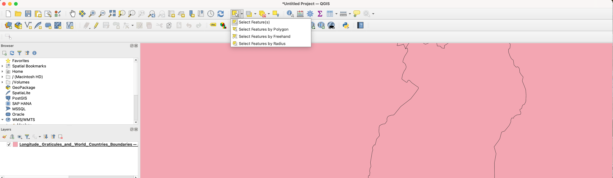
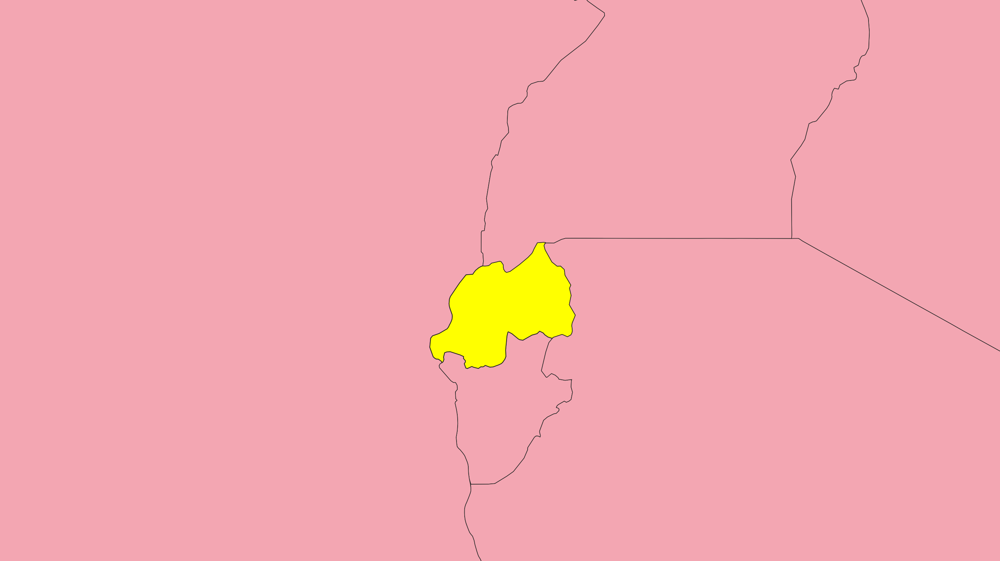
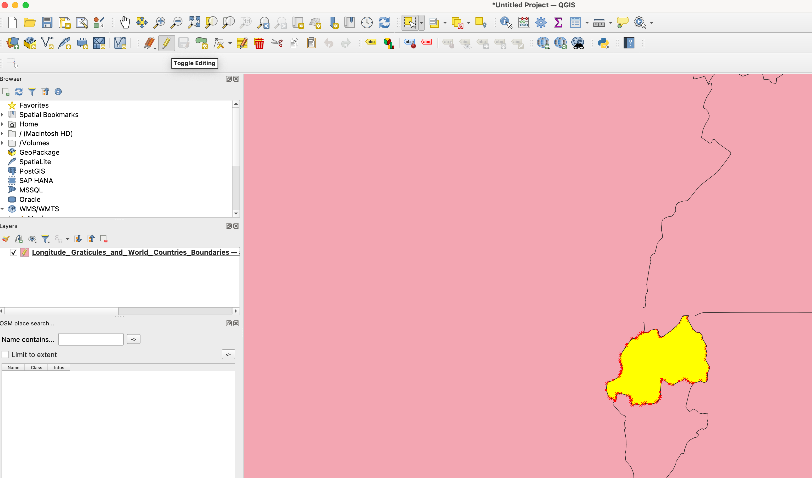
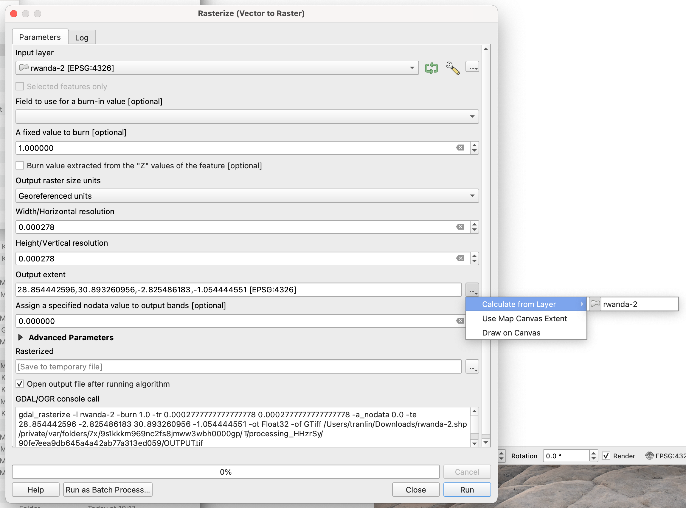

# Country masks

The following step-by-step description explains how to extract a country boundary and rasterize it to a tiff file.

1. Download the country boundaries as GeoJSON from [ArcGIS Hub: UIA Latitude/Longitude Graticules and World Countries Boundaries
](https://hub.arcgis.com/datasets/UIA::uia-latitude-longitude-graticules-and-world-countries-boundaries/about?layer=1). For that click on `Download`, select `GeoJSON` as format and save the file (`Longitude_Graticules_and_World_Countries_Boundaries.geojson`).
2. Open the file (`Longitude_Graticules_and_World_Countries_Boundaries.geojson`) with QGIS.
3. Click on `Select Feature(s)` in the top bar, first row (see screenshot below).



4. Click on the country that you would like to extract and rasterize. The selected country should be displayed in a different color after clicking on it.



5. Click on `Toggle Editing` (top bar, second row, symbol displays a pencil) and you should see the polygon points being displayed.



6. Click on `Cut Features` (top bar, second row, symbol displays scisscors).
7. Click on `Edit` -> `Paste Features as` -> `New Vector Layer...`. Set the format as `ESRI Shapefile`. Set a file path by click the button with `...` next to the file name edit field.
8. Click on `Raster` -> `Conversion` -> `Rasterize (Vector to Raster)`. Use a resolution of 1/3600 and a value of 1.0 for values within the polygon and a value of 0.0 for no data fields. All settings are shown in the screenshot below.



## Data structure

The folder has the following structure after downloading and processing the data:

```
data/country_masks/
├── Longitude_Graticules_and_World_Countries_Boundaries.geojson
├── README.md
├── rwanda.dbf
├── rwanda_mask_1-3600.tiff
├── rwanda.prj
├── rwanda.shp
├── rwanda.shx
├── uganda.dbf
├── uganda_mask_1-3600.tiff
├── uganda.prj
├── uganda.shp
└── uganda.shx
```
